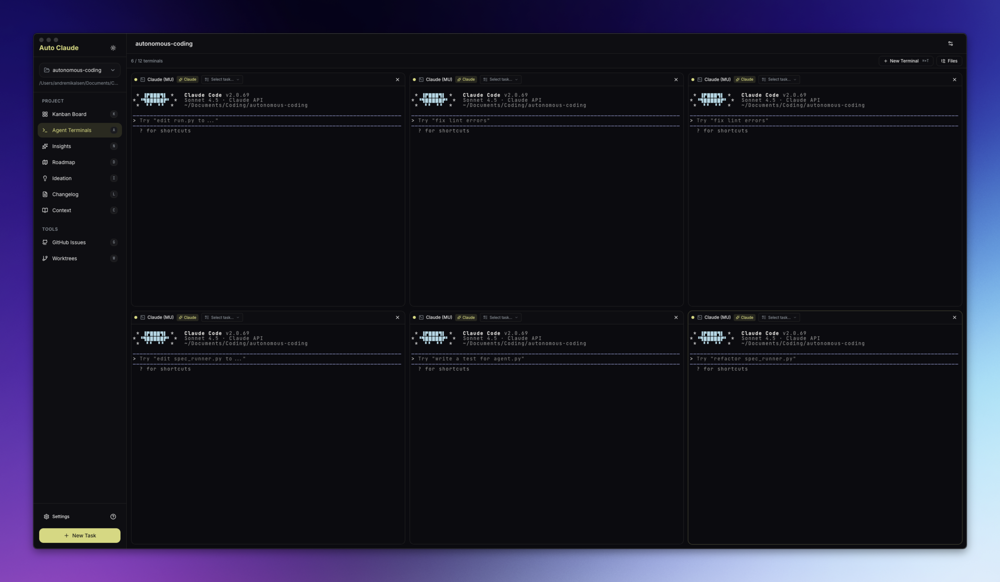
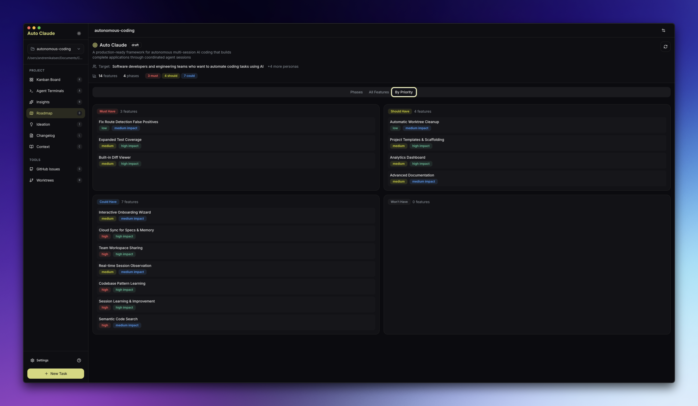

# Turret

**Autonomous multi-agent coding framework that plans, builds, and validates software for you.**


[](https://github.com/savageops/turret/releases/latest)
[](./agpl-3.0.txt)
[](https://discord.gg/KCXaPBr4Dj)
[](https://github.com/savageops/turret/actions)

---

## Table of Contents

- [Overview](#overview)
- [Download](#download)
- [Requirements](#requirements)
- [Quick Start](#quick-start)
- [Features](#features)
- [Architecture](#architecture)
- [Usage](#usage)
  - [Desktop Application](#desktop-application)
  - [CLI Usage](#cli-usage)
- [Configuration](#configuration)
- [Building from Source](#building-from-source)
- [Development](#development)
- [Troubleshooting](#troubleshooting)
- [Security](#security)
- [Contributing](#contributing)
- [Community](#community)
- [License](#license)

---

## Overview

Turret is an autonomous coding framework powered by Claude AI that transforms high-level task descriptions into fully implemented, tested, and validated software features. Instead of manually writing code, you describe what you want to build, and Turret's multi-agent system handles the entire development lifecycle:

1. **Planning** - Analyzes your codebase and creates a detailed implementation plan
2. **Implementation** - Executes the plan with autonomous agents that write, test, and refine code
3. **Validation** - Runs comprehensive QA checks to ensure quality
4. **Integration** - Provides safe merge workflows with conflict resolution

All changes happen in isolated Git worktrees, keeping your main branch safe until you're ready to merge.

---

## Download

Get the latest pre-built release for your platform:

| Platform | Download | Notes |
|----------|----------|-------|
| **Windows** | [Turret-2.7.2.exe](https://github.com/savageops/turret/releases/latest) | Installer (NSIS) |
| **macOS (Apple Silicon)** | [Turret-2.7.2-arm64.dmg](https://github.com/savageops/turret/releases/latest) | M1/M2/M3 Macs |
| **macOS (Intel)** | [Turret-2.7.2-x64.dmg](https://github.com/savageops/turret/releases/latest) | Intel Macs |
| **Linux** | [Turret-2.7.2.AppImage](https://github.com/savageops/turret/releases/latest) | Universal |
| **Linux (Debian)** | [Turret-2.7.2.deb](https://github.com/savageops/turret/releases/latest) | Ubuntu/Debian |

> All releases include SHA256 checksums and VirusTotal scan results for security verification.

---

## Requirements

- **Claude Pro/Max subscription** - [Get one here](https://claude.ai/upgrade)
- **Claude Code CLI** - `npm install -g @anthropic-ai/claude-code`
- **Git repository** - Your project must be initialized as a git repo
- **Python 3.12+** - Required for the backend and Memory Layer

---

## Quick Start

### Desktop Application (Recommended)

1. **Download and install** the app for your platform from [GitHub Releases](https://github.com/savageops/turret/releases/latest)
2. **Open your project** - Launch Turret and select a git repository folder
3. **Connect Claude** - The app will guide you through OAuth setup
4. **Create a task** - Describe what you want to build in the Kanban board
5. **Watch it work** - Agents plan, code, and validate autonomously

### CLI (Headless/CI/CD)

```bash
# Navigate to backend
cd apps/backend

# Set up environment
python -m venv .venv
source .venv/bin/activate  # Windows: .venv\Scripts\activate
pip install -r requirements.txt

# Configure
cp .env.example .env
# Add CLAUDE_CODE_OAUTH_TOKEN (get via: claude setup-token)

# Create a spec
python spec_runner.py --interactive

# Run autonomous build
python run.py --spec 001
```

See [guides/CLI-USAGE.md](guides/CLI-USAGE.md) for complete CLI documentation.

---

## Features

| Feature | Description |
|---------|-------------|
| **Autonomous Tasks** | Describe your goal; agents handle planning, implementation, and validation |
| **Parallel Execution** | Run multiple builds simultaneously with up to 12 agent terminals |
| **Isolated Workspaces** | All changes happen in git worktrees - your main branch stays safe |
| **Self-Validating QA** | Built-in quality assurance loop catches issues before you review |
| **AI-Powered Merge** | Automatic conflict resolution when integrating back to main |
| **Memory Layer** | Agents retain insights across sessions for smarter builds |
| **Cross-Platform** | Native desktop apps for Windows, macOS, and Linux |
| **Auto-Updates** | App updates automatically when new versions are released |

### Desktop Interface

#### Kanban Board
Visual task management from planning through completion. Create tasks and monitor agent progress in real-time.

#### Agent Terminals
AI-powered terminals with one-click task context injection. Spawn multiple agents for parallel work.



#### Roadmap
AI-assisted feature planning with competitor analysis and audience targeting.



#### Additional Features
- **Insights** - Chat interface for exploring your codebase
- **Ideation** - Discover improvements, performance issues, and vulnerabilities
- **Changelog** - Generate release notes from completed tasks

---

## Architecture

Turret consists of two main components:

### Python Backend (`apps/backend/`)

The core autonomous coding framework:

- **Agent System** - Multi-agent architecture with specialized roles (planner, coder, QA reviewer, QA fixer)
- **Spec Management** - Task specifications with complexity-based phase planning
- **Workspace Isolation** - Git worktree-based isolation for safe parallel builds
- **Memory System** - Dual-layer memory (Graphiti graph database + file-based fallback)
- **QA Pipeline** - Automated validation with iterative fix cycles
- **Merge System** - AI-powered conflict resolution

**Key Modules:**
- `agents/` - Agent execution and coordination
- `spec/` - Specification management and validation
- `core/` - Core utilities (workspace, client, auth)
- `merge/` - Git merge and conflict resolution
- `qa/` - Quality assurance validation
- `memory/` - Cross-session memory system
- `project/` - Project analysis and detection

### Electron Frontend (`apps/frontend/`)

Desktop interface built with React and TypeScript:

- **Main Process** - Electron main process with IPC handlers
- **Renderer** - React UI components with Zustand state management
- **IPC Communication** - Secure communication between renderer and main process

**Key Features:**
- Project management and task creation
- Real-time progress tracking
- Terminal integration for agent communication
- File explorer and diff viewing
- Settings and configuration UI

### Project Structure

```
Turret/
├── apps/
│   ├── backend/          # Python agents, specs, QA pipeline
│   │   ├── agents/       # Agent execution modules
│   │   ├── spec/         # Specification management
│   │   ├── core/         # Core utilities
│   │   ├── merge/        # Merge and conflict resolution
│   │   ├── qa/           # Quality assurance
│   │   ├── memory/       # Memory system
│   │   └── project/      # Project analysis
│   └── frontend/         # Electron desktop application
│       ├── src/
│       │   ├── main/     # Electron main process
│       │   ├── renderer/ # React UI components
│       │   └── shared/   # Shared types and utilities
├── guides/               # Additional documentation
├── tests/                # Test suite
└── scripts/               # Build utilities
```

For detailed architecture information, see [CLAUDE.md](CLAUDE.md).

---

## Usage

### Desktop Application

#### Creating Tasks

1. Open the Kanban board
2. Click "New Task" or drag a GitHub issue onto the board
3. Describe what you want to build
4. Optionally attach reference files or images
5. Select agent profile (Auto, Balanced, Fast, or Thorough)
6. Click "Create Task"

#### Monitoring Progress

- **Kanban Board** - Visual status tracking (planning → coding → qa → review)
- **Task Detail View** - Detailed progress, logs, and file changes
- **Agent Terminals** - Real-time agent output and interaction
- **Diff View** - Review all changes before merging

#### Reviewing and Merging

1. When a task reaches "human_review" status, review the changes
2. Use the diff view to see all modifications
3. Optionally discard specific files you don't want
4. Stage the task when satisfied
5. Merge to your main branch when ready

### CLI Usage

For headless operation, CI/CD integration, or terminal-only workflows:

```bash
cd apps/backend

# Create a spec interactively
python spec_runner.py --interactive

# Run autonomous build
python run.py --spec 001

# Review changes
python run.py --spec 001 --review

# Merge to main
python run.py --spec 001 --merge

# Discard changes
python run.py --spec 001 --discard
```

**Common Commands:**

| Command | Description |
|---------|-------------|
| `python run.py --list` | List all specs and their status |
| `python run.py --spec 001` | Run spec 001 |
| `python run.py --spec 001 --isolated` | Run in isolated workspace |
| `python run.py --spec 001 --merge` | Merge completed build |
| `python run.py --spec 001 --review` | Review build changes |
| `python run.py --spec 001 --discard` | Discard build |
| `python run.py --spec 001 --qa` | Run QA validation |

See [guides/CLI-USAGE.md](guides/CLI-USAGE.md) for complete CLI documentation.

---

## Configuration

### Environment Variables

Create `apps/backend/.env` from the example:

```bash
cp apps/backend/.env.example apps/backend/.env
```

| Variable | Required | Description |
|----------|----------|-------------|
| `CLAUDE_CODE_OAUTH_TOKEN` | Yes | OAuth token from `claude setup-token` |
| `GRAPHITI_ENABLED` | No | Enable Memory Layer for cross-session context |
| `AUTO_BUILD_MODEL` | No | Override the default Claude model |
| `LINEAR_API_KEY` | No | Enable Linear integration for issue tracking |
| `DEBUG` | No | Enable debug logging |
| `DEBUG_LEVEL` | No | Debug verbosity (1-3) |

### Agent Profiles

Configure agent behavior in Settings → Agent Profiles:

- **Auto (Optimized)** - Automatically selects the best profile based on task complexity
- **Balanced** - Good balance of speed and quality (default)
- **Fast** - Prioritizes speed over thoroughness
- **Thorough** - Maximum quality with comprehensive validation

### Phase Configuration

Customize the build pipeline phases in Settings → Phase Configuration:

- **Planning** - Initial analysis and specification
- **Implementation** - Code writing and execution
- **QA Validation** - Quality assurance checks
- **Review** - Human review and approval

---

## Building from Source

For contributors and development:

```bash
# Clone the repository
git clone https://github.com/savageops/turret.git
cd turret

# Install all dependencies
npm run install:all

# Run in development mode
npm run dev

# Or build and run
npm start
```

**System requirements for building:**
- Node.js 24+
- Python 3.12+ (see setup instructions below)
- npm 10+

See [CONTRIBUTING.md](CONTRIBUTING.md) for detailed development setup.

---

## Development

### Prerequisites

- **Python 3.12+** - For the backend framework
- **Node.js 24+** - For the Electron frontend
- **npm 10+** - Package manager
- **Git** - Version control

### Setup

```bash
# Install backend dependencies
npm run install:backend

# Install frontend dependencies
npm run install:frontend

# Or install both
npm run install:all
```

### Running Tests

```bash
# Backend tests
npm run test:backend

# Frontend tests
cd apps/frontend && npm test

# Linting
npm run lint
```

### Available Scripts

| Command | Description |
|---------|-------------|
| `npm run install:all` | Install backend and frontend dependencies |
| `npm start` | Build and run the desktop app |
| `npm run dev` | Run in development mode with hot reload |
| `npm run package` | Package for current platform |
| `npm run package:mac` | Package for macOS |
| `npm run package:win` | Package for Windows |
| `npm run package:linux` | Package for Linux |
| `npm run lint` | Run linter |
| `npm test` | Run frontend tests |
| `npm run test:backend` | Run backend tests |

For detailed development guidelines, see [CONTRIBUTING.md](CONTRIBUTING.md).

---

## Troubleshooting

### Python Installation (Critical)

**⚠️ Use Python 3.12.10 specifically** - newer versions like 3.14 may not have prebuilt wheels for native dependencies.

#### Windows

1. **Download Python 3.12.10**: https://www.python.org/downloads/release/python-31210/
   - Get "Windows installer (64-bit)"
   - ✅ Check "Add Python to PATH" during installation
   - ✅ Check "Install for all users" (recommended)

2. **Install CMake**: https://cmake.org/download/
   - Get the Windows x64 Installer (.msi)
   - ✅ Check "Add CMake to system PATH" during installation

3. **Install Visual Studio Build Tools**: https://visualstudio.microsoft.com/visual-cpp-build-tools/
   - Click "Download Build Tools"
   - In the installer, select "Desktop development with C++"
   - This provides the C++ compiler needed for native Python packages

4. **Restart your terminal/IDE** after installing to refresh PATH variables

5. **Run installation**:
   ```bash
   npm run install:all
   ```

#### macOS

```bash
# Install Python 3.12
brew install python@3.12

# Install dependencies
npm run install:all
```

#### Linux (Ubuntu/Debian)

```bash
# Install Python 3.12 and build tools
sudo apt update
sudo apt install python3.12 python3.12-venv build-essential cmake

# Install dependencies
npm run install:all
```

### Common Errors

#### ❌ "Python 3.12+ is required but not found"

**Cause**: Python not in PATH or wrong version installed

**Solution**:
1. Verify installation: `python --version` (should show 3.12.x)
2. If not found, restart your terminal/IDE
3. If still not found, add Python to PATH manually:
   - Windows: Add `C:\Users\<YourUser>\AppData\Local\Programs\Python\Python312` to PATH
   - Run `setx PATH "%PATH%;C:\Users\<YourUser>\AppData\Local\Programs\Python\Python312"`

#### ❌ "Building wheel for real_ladybug failed"

**Cause**: Missing C++ compiler or CMake

**Solution (Windows)**:
1. Install Visual Studio Build Tools (see Python Installation section above)
2. Install CMake (see Python Installation section above)
3. Restart terminal and run `npm run install:all` again

**Why this happens**: The `real_ladybug` package (LadybugDB embedded graph database) requires compiling C++ code. Python 3.14 is too new and doesn't have prebuilt binaries yet.

#### ❌ "npm ERR! Electron failed to install correctly"

**Cause**: Network issues or missing system dependencies

**Solution**:
```bash
# Clear npm cache
npm cache clean --force

# Remove node_modules
rm -rf node_modules apps/*/node_modules

# Reinstall
npm run install:all
```

#### ❌ Backend virtual environment issues

**Solution**:
```bash
# Remove existing venv
rm -rf apps/backend/.venv

# Reinstall backend
cd apps/backend
python -m venv .venv
.venv/Scripts/activate  # Windows
# or
source .venv/bin/activate  # macOS/Linux

pip install -r requirements.txt
```

### Verifying Installation

After successful installation, verify everything works:

```bash
# Check Python version
python --version  # Should show Python 3.12.10

# Check backend venv
apps/backend/.venv/Scripts/python --version  # Windows
apps/backend/.venv/bin/python --version      # macOS/Linux

# Check CMake (Windows only)
cmake --version  # Should show cmake version 4.2.1 or higher

# Run the app
npm run dev
```

---

## Security

Turret uses a three-layer security model:

1. **OS Sandbox** - Bash commands run in isolation
2. **Filesystem Restrictions** - Operations limited to project directory
3. **Dynamic Command Allowlist** - Only approved commands based on detected project stack

All releases are:
- Scanned with VirusTotal before publishing
- Include SHA256 checksums for verification
- Code-signed where applicable (macOS)

### Security Profile

Turret analyzes your project to create a security profile that:
- Detects your tech stack (Node.js, Python, Docker, etc.)
- Builds a dynamic allowlist of safe commands
- Restricts file operations to the project directory
- Caches the security profile for performance

The security profile is cached in `.turret-security.json` and regenerated when your project structure changes.

---

## Contributing

We welcome contributions! Please read [CONTRIBUTING.md](CONTRIBUTING.md) for:
- Development setup instructions
- Code style guidelines
- Testing requirements
- Pull request process
- Git workflow (Git Flow)

### Quick Contribution Guide

1. Fork the repository
2. Create a branch from `develop` (not `main`!)
3. Make your changes following the code style guidelines
4. Write tests for new features
5. Run tests and linting
6. Submit a pull request to `develop`

See [CONTRIBUTING.md](CONTRIBUTING.md) for complete guidelines.

---

## Community

- **Discord** - [Join our community](https://discord.gg/KCXaPBr4Dj)
- **Issues** - [Report bugs or request features](https://github.com/savageops/turret/issues)
- **Discussions** - [Ask questions](https://github.com/savageops/turret/discussions)

---

## License

**AGPL-3.0** - GNU Affero General Public License v3.0

Turret is free to use. If you modify and distribute it, or run it as a service, your code must also be open source under AGPL-3.0.

Commercial licensing available for closed-source use cases.

---

## Acknowledgments

Turret is built on top of:
- [Claude Agent SDK](https://github.com/anthropics/claude-agent-sdk) - AI agent framework
- [Graphiti](https://github.com/anthropics/graphiti) - Memory and context system
- [Electron](https://www.electronjs.org/) - Desktop application framework
- [React](https://react.dev/) - UI library

---

**Made with ❤️ by the Turret team**
